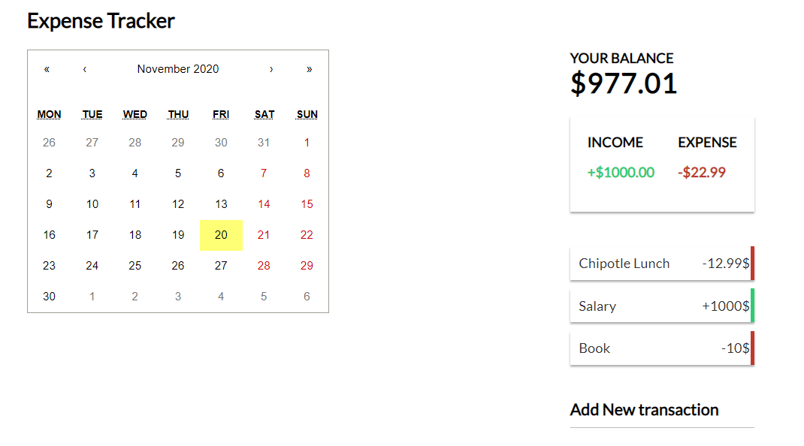
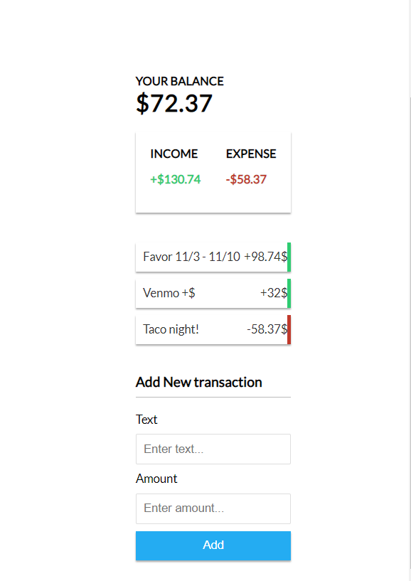

# Expense Tracker

  Keep track of income and expenses. Add and remove items and save to local storage. Will eventually include color coding and ways to visualize trends over time
  
  ICEBOX: 
  - [x] adding a calendar component and a date aspect to the GlobalState {https://www.npmjs.com/package/react-calendar}
  - [ ] scaling and size calendar to an appropriate level
  - [ ] adding backend for data collection
  - [ ] adding ways to visualize trends overtime 
  - [ ] tuck away transaction history beyond 4 most recent to be viewed from the calendar component
  
## Usage

-`npm install`

-Run on http://localhost:3000

-`npm start`

## Screen Shots

